<h1 align = "center">Prisoners Information Analysis</h1>

<i>Data Visualization Report by Subhash Patel (210150017)</i>

# Motivation

Data visualization serves as a powerful lens through which we can gain deeper insights into the complex dynamics of environmental phenomena. 

Analysing Prisoners Information for the **Crime** theme gives us many insights like:

1. **Insight into Criminal Justice System:** Analyzing prisoner information provides valuable insights into the functioning of the criminal justice system. It allows us to understand various aspects such as incarceration rates, demographics of the prison population, length of sentences, and recidivism rates. By delving into this data, we gain a deeper understanding of how the justice system operates and its impact on individuals and society.

2. **Public Safety and Rehabilitation:** Understanding the characteristics of prisoners can aid in enhancing public safety measures and rehabilitation programs. By examining factors such as types of offenses committed, demographics of inmates, and educational and vocational backgrounds, we can identify patterns and trends that inform policymaking and intervention strategies aimed at reducing crime rates and promoting successful reintegration into society.

**Now, let's delve into the data we've collected and explore various aspects of prisoner information through data visualization.**

The sections are as follows:
1. Dataset
2. Educational Background of Criminals
3. Domicile Information
4. Age Groups
5. Types of Offences
6. Religion 
7. Gender
8. Conclusion

# Dataset
This dataset contains information about the prisoners in India in 2020. A criminal is a person who is guilty of a crime, notably breaking the law. A prisoner is a person incarcerated in a prison, while on trial or serving a sentence

## Data Description

* It has 87 columns and 39 rows. The columns include the state or union territory, the educational standard, the domicile, the religion, the gender, the age group, the type of prison, and the type of offense.
* The rows include the total for each state or union territory and the total for all of India.
* The dataset is based on the Prison Statistics India (PSI) report published by the National Crime Records Bureau (NCRB).
* The dataset can be used for analysis and visualization of the prisoner's statistics

# Education Analysis

Analyzing the educational background of prisoners reveals intriguing insights into the correlation between education and criminal behavior. Remarkably, the data showcases a significant proportion, approximately 30%, of prisoners classified as illiterate, with an additional 40% having dropped out before completing high school. This observation suggests a potential association between lower levels of education and involvement in criminal activities. While correlation does not imply causation, the prevalence of individuals with limited educational attainment within the prison population underscores the importance of addressing educational disparities as a preventive measure against criminal behavior. Moreover, it emphasizes the potential role of education in fostering social inclusion, economic opportunities, and pathways away from crime. 
Further research and targeted interventions aimed at improving access to education and addressing educational inequalities could potentially contribute to reducing recidivism rates and promoting rehabilitation among offenders.

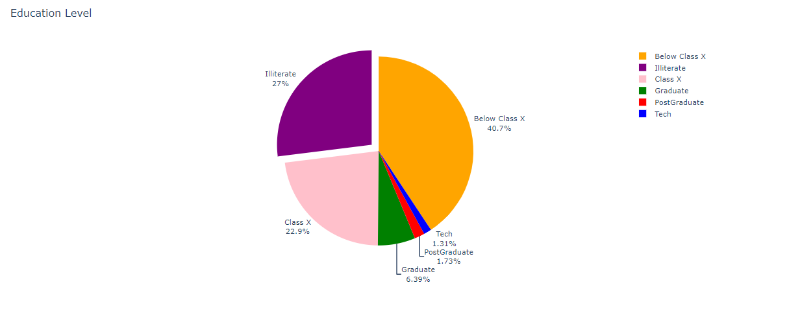

# Domicile Information

* The analysis of domicile information among prisoners provides valuable insights into migration patterns and potential factors influencing criminal behavior. The observed ratio of prisoners from the same state compared to those from other states, with an average value of around 15 and ranging from 3 to 200, offers several noteworthy conclusions.

* Firstly, a higher ratio of prisoners originating from the same state suggests a potential correlation between local socioeconomic factors and crime rates. Areas with higher ratios may indicate underlying social issues such as poverty, unemployment, or lack of educational opportunities, which could contribute to criminal behavior within the community.

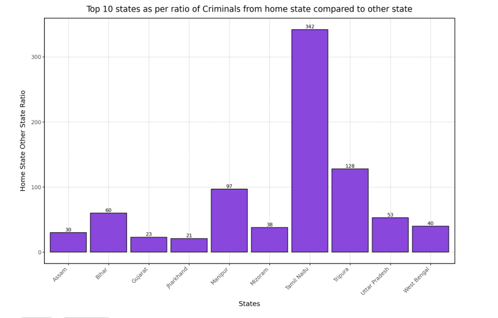 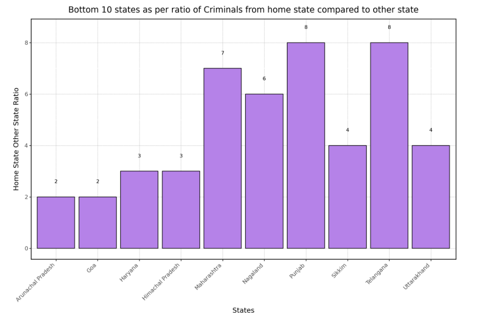 

* Conversely, states with lower ratios may suggest either stricter law enforcement measures or lower crime rates, leading to a lower number of local offenders in the prison population. Additionally, they may indicate higher rates of migration or mobility, where individuals move to other states for employment, education, or other reasons, potentially leading to a more diverse prison population.

* Overall, the analysis of domicile information highlights the complex interplay of socioeconomic, cultural, and legal factors influencing crime rates and underscores the importance of targeted interventions tailored to address the specific needs of different regions to effectively combat crime and promote community safety and well-being.

# Age Groups

The age distribution among criminals underscores a notable trend where approximately 30% fall within the 18 to 30-year-old bracket, indicative of a significant presence of younger individuals in the prison system. Moreover, a substantial portion, around 50%, comprises offenders aged between 30 and 50 years. Notably, some regions exhibit a disproportionately higher concentration of offenders aged 18 to 30, suggesting potential localized factors contributing to criminal activity among younger demographics. Understanding these variations is crucial for devising targeted interventions and rehabilitation programs tailored to different age groups. By addressing the underlying socioeconomic and environmental factors influencing criminal behavior, authorities can effectively mitigate crime rates and promote societal reintegration.

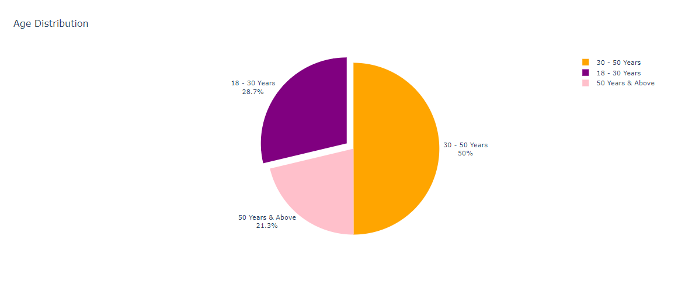

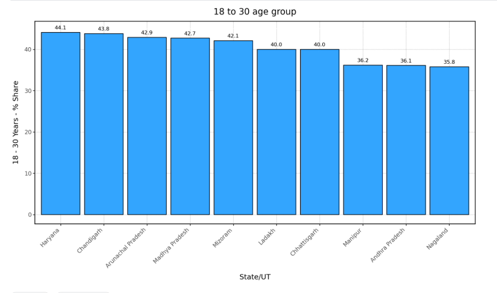 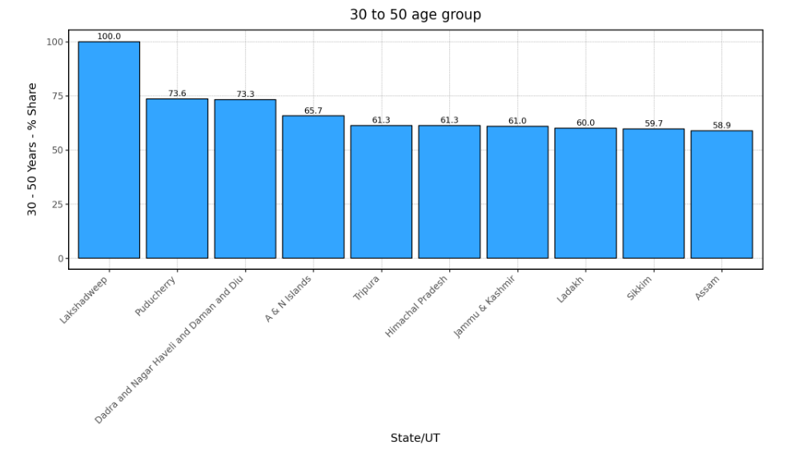 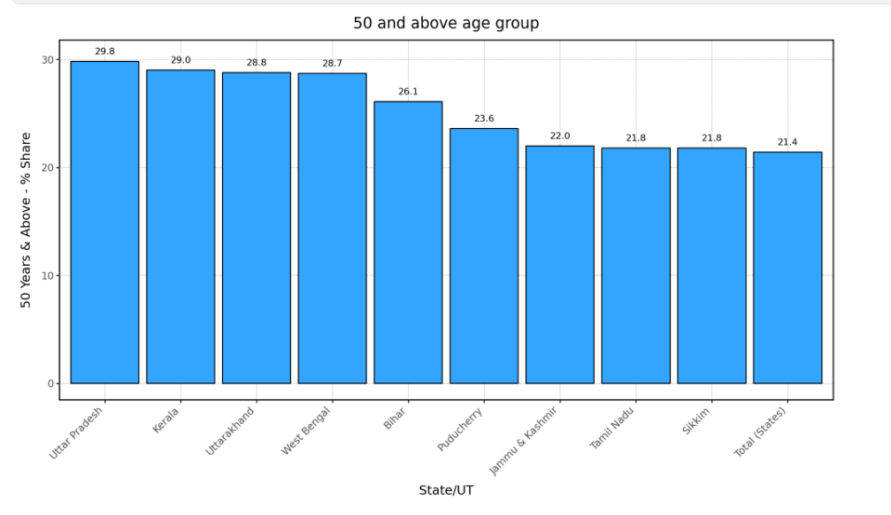 

# Types of Offences

## What are the common types of offences criminals are prisoned for

Let's look at the distribution of major crime categories using a pie chart and bar graph in an ALL India scale

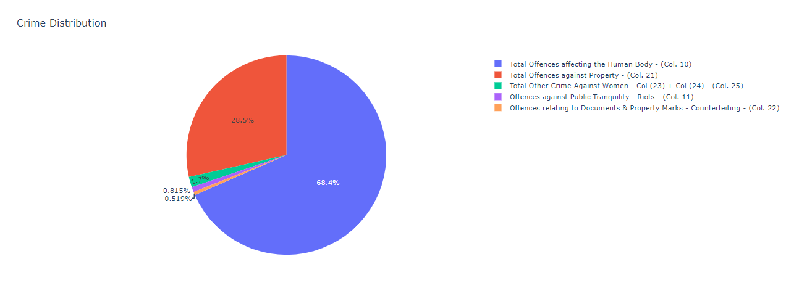
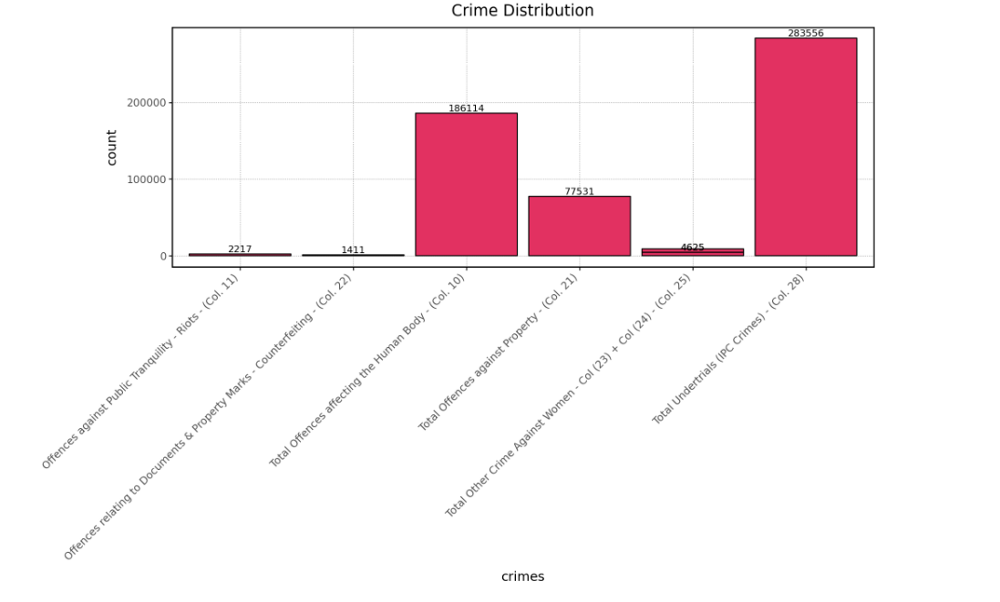
Conclusions on the Types of Offenses Committed by Prisoners:

1. Prevalence of Crimes Against Human Body: The data highlights that the majority of offenses committed by prisoners revolve around crimes against the human body, constituting approximately 68.4% of the cases studied. This category encompasses a wide range of offenses including murders which visibly constitutes the highest numbers followed by attempt to murder and rapes also homicide, and related violent crimes, underscoring the significance of addressing violence prevention and victim support initiatives within correctional facilities. 

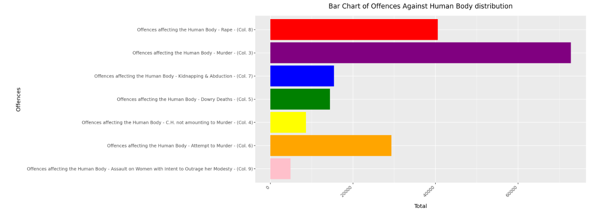

2. Significance of Property-related Offenses: Nearly 28.5% of the recorded offenses are related to crimes affecting properties. These offenses may include burglary, theft, vandalism, and other forms of property damage. Addressing these crimes not only involves punishment but also efforts towards rehabilitation and skill-building to deter recidivism and promote productive reintegration into society upon release.

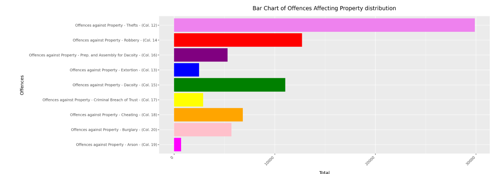

3. Attention to Crimes Against Women: Despite forming a smaller percentage at 1.7%, crimes against women warrant specific attention due to their sensitive nature and potential long-term impact on individuals and communities. Strategies aimed at preventing gender-based violence and providing support services for survivors should be integral components of rehabilitation programs within correctional settings.

4. Mitigating Riots and Disorder: Although accounting for a relatively small percentage at 0.8%, incidents of riots within prisons can have significant implications for the safety and security of both inmates and staff. Measures to address underlying causes such as overcrowding, inadequate resources, and tensions among incarcerated individuals are essential for maintaining order and fostering a conducive environment for rehabilitation.

5. Combatting Counterfeiting: While constituting only 0.5% of the offenses, counterfeiting remains a noteworthy concern within correctional facilities. Efforts to combat counterfeiting not only involve enforcement actions but also educational initiatives to raise awareness about the consequences of engaging in fraudulent activities.

In conclusion, understanding the distribution and nature of offenses committed by prisoners is essential for designing effective policies and interventions aimed at promoting rehabilitation, reducing recidivism, and fostering safer communities. Addressing the diverse range of offenses requires a multi-faceted approach that integrates punishment, rehabilitation, and community support to facilitate the successful reintegration of individuals into society.

### Distribution of Offence against Human Body and Affecting Property for top 6 states

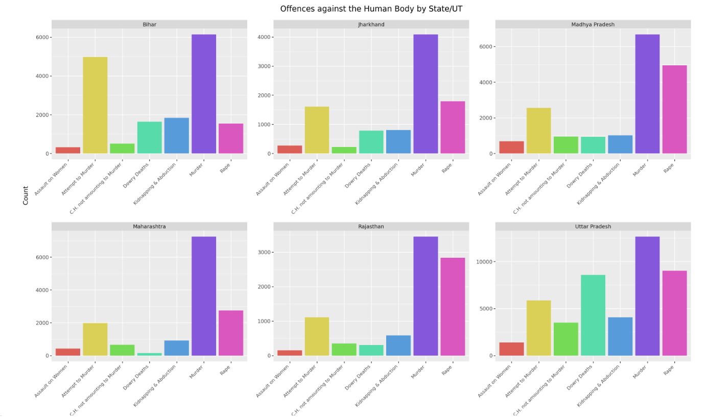

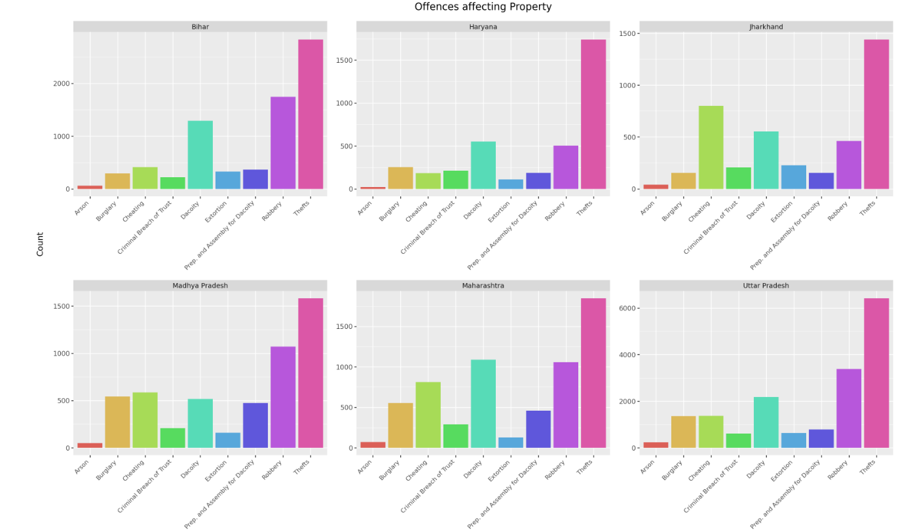

# Religion 

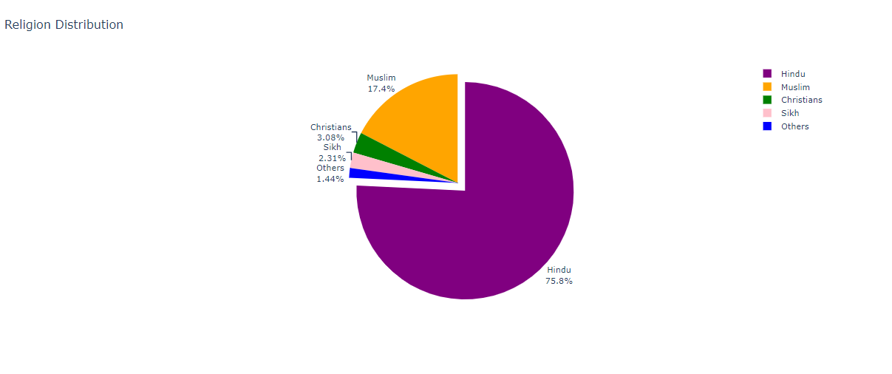

* The analysis of religious demographics among incarcerated individuals reveals a proportional distribution reflective of the broader population composition. Hindus comprise the largest proportion at 75%, followed by Muslims at 18%, Christians at 3%, and Sikhs at 2%.

* The alignment of these figures with general population ratios suggests that criminal behavior is not inherently tied to any specific religious affiliation. Rather, it underscores the universal nature of crime and the need for comprehensive strategies to address its root causes across all segments of society.

**Furthermore** , it's imperative to emphasize that religion itself is not a determinant of criminal behavior. While faith-based initiatives may play a role in rehabilitation and moral guidance for some individuals, effective interventions must be inclusive and respect the diverse religious beliefs and cultural backgrounds of incarcerated individuals.

# Gender 

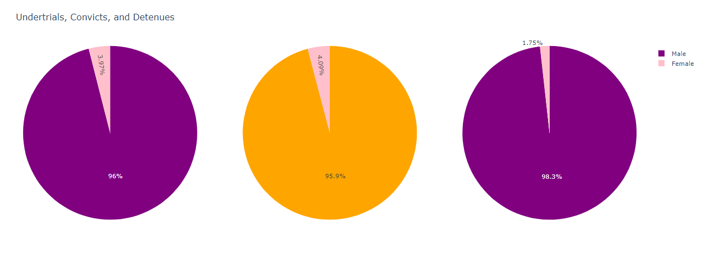 

# Conclusion

In conclusion, this report sheds light on various aspects of prisoner information in India, offering valuable insights into the intricate dynamics of the criminal justice system. Through comprehensive analysis and visualization, we've delved into crucial themes such as educational background, domicile information, age distribution, types of offenses, religion, and gender demographics among incarcerated individuals.

The analysis of educational backgrounds underscores the potential correlation between lower levels of education and involvement in criminal activities, emphasizing the importance of addressing educational disparities as a preventive measure against crime. Additionally, examining domicile information reveals insights into migration patterns and regional socioeconomic factors influencing crime rates.

Age distribution among prisoners highlights the prevalence of younger individuals within the prison system, necessitating targeted interventions tailored to different age groups for effective rehabilitation and crime prevention. Moreover, the examination of offense types underscores the need for multifaceted approaches to address various forms of criminal behavior, from crimes against the human body to property-related offenses and crimes against women.

Religious demographics among prisoners reflect a proportional distribution reflective of the broader population, emphasizing the universal nature of crime irrespective of religious affiliation. Lastly, the gender distribution among prisoners showcases a consistent ratio across convicted individuals, undertrials, and detainees, indicating the importance of gender-responsive approaches within the criminal justice system.

This report underscores the power of data visualization in uncovering nuanced insights. By leveraging data-driven approaches, we can strive towards a more equitable and effective criminal justice system that upholds principles of fairness, dignity, and human rights for all individuals involved.

